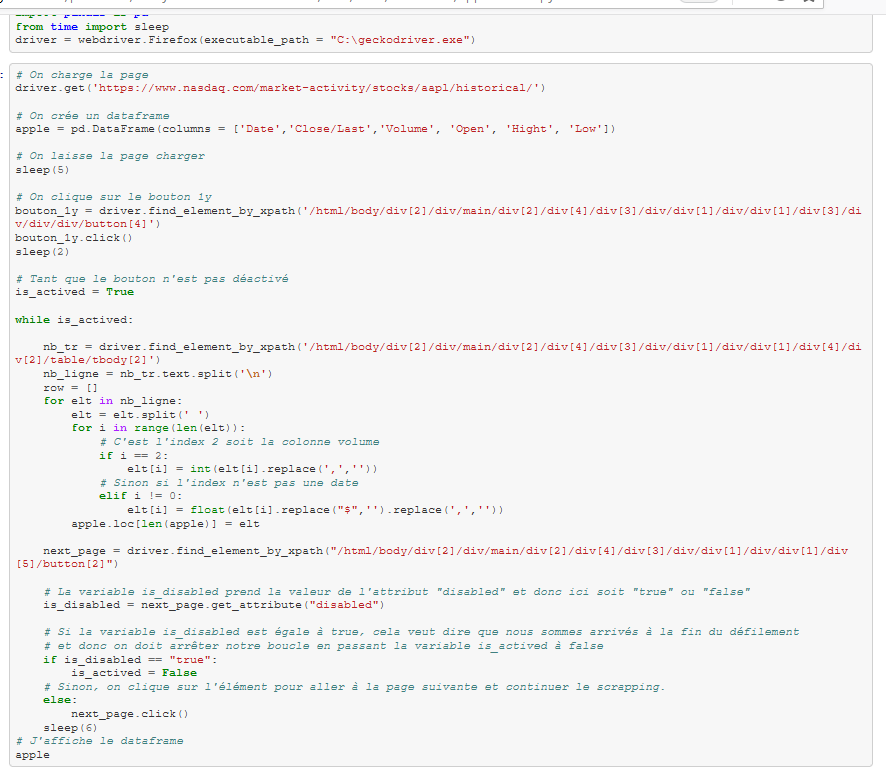

# Analyse financière sur la toile

```
objectif : Apprendre à utiliser un outil de web scraping pour récolter des données et les stocker en bdd.
```

# Choix des données et des outils :

dataset : https://www.nasdaq.com/market-activity/stocks/aapl/historical => cours des actions apple sur 1 an 

scrapping : selenium

bdd:mysql 

visualisation des données : grafana

utilisation de docker 


# Construction d'un notebook pour extraire les données .

Le "scapper" choisi l'année dans la page web, et ensuite sélectionne toutes les données en passant d'une page à l'autre.
On injecte les données dans un tableau panda que l'on transforme en csv.


# Base de données:
On importe le fichier CSV dans mysql attention au format des nombres, dates ...;


!(image](dockercompose.PNG)



# Docker


# Visualisation des données sous grafana.


