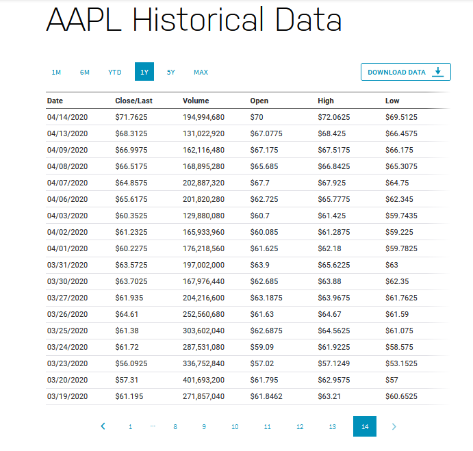
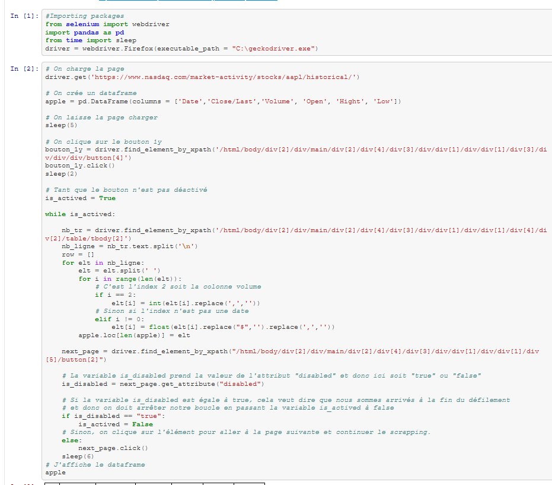
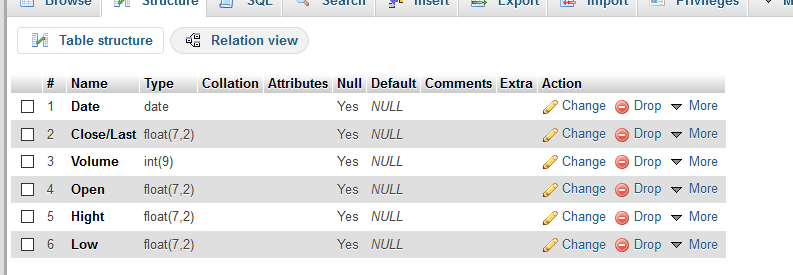
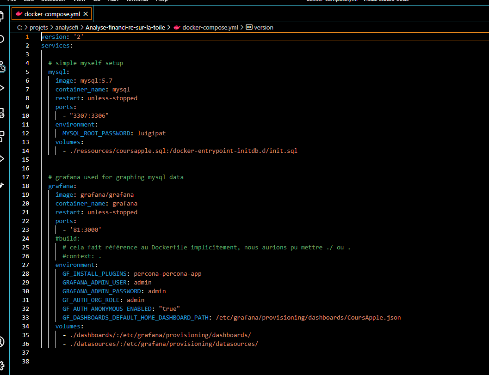
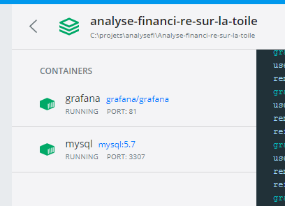

# Analyse financière sur la toile

```
objectif : Apprendre à utiliser un outil de web scraping pour récolter des données et les stocker en bdd.
```

# Choix des données et des outils :

dataset : https://www.nasdaq.com/market-activity/stocks/aapl/historical => cours des actions apple sur 1 an 

scrapping : selenium

bdd : mysql 

visualisation des données : grafana

utilisation de docker 

Pour le scrapping, nous avons décidé d'utiliser selenium après avoir étudié BeautifulSoup et scraper. L'outil nous permettant la mise en place d'un "robot" performant qui va de paes en pages.
Nous avons choisi d'utiliser grafana pour visualiser nos graphes, l'outil étant assez intuitif et permettant la réalisation de graphiques explicites.
Le tout combiné à mysql pour notre base de données. Les outils sont gratuits et  la combinaison grafana-mysql est performante .

Toute la construction des conteneurs, la configuration de grafana et l'insertion des données se fait à partir d'un docker-compose.yml

Visualisation des données : 



# Construction d'un notebook pour extraire les données .

Le "scapper" choisi l'année dans la page web, et ensuite sélectionne toutes les données en passant d'une page à l'autre.
nb: le geckodriver.exe est necessaire à l'exécution du fichier (nous utilisons la version adaptée au navigateur web que nous utilisons à savoir firefox)
On injecte les données dans un tableau panda que l'on transforme en csv pour la suite de notre étude.



# Base de données
On importe le fichier CSV dans mysql en intégrant les formats qui nous servirons pour la suite de notre étude.



# Mise en place des containers

préparation du docker compose


````
# on se place sur le répertoire
(base) C:\Users\utilisateur>cd C:\projets\analysefi\Analyse-financi-re-sur-la-toile

# on crée nos containers
(base) C:\projets\analysefi\Analyse-financi-re-sur-la-toile>docker-compose up -d
Creating network "analyse-financi-re-sur-la-toile_default" with the default driver
Creating grafana ... done
Creating mysql   ... done

# on dépose notre bbd dans docker
(base) C:\projets\analysefi\Analyse-financi-re-sur-la-toile>docker cp C:\projets\analysefi\Analyse-financi-re-sur-la-toile\ressources/coursapple.sql mysql:/

#on se connecte à mysql
(base) C:\projets\analysefi\Analyse-financi-re-sur-la-toile>docker exec -it mysql bash

root@5a088a0ab7c5:/# mysql -u root -pluigipat

mysql> create database apple;
Query OK, 1 row affected (0.00 sec)

mysql> use apple;
Database changed

mysql> source coursapple.sql;


#visualisation des bases existantes

mysql> show databases;
+--------------------+
| Database           |
+--------------------+
| information_schema |
| apple              |
| mysql              |
| performance_schema |
| sys                |
+--------------------+

#on se place sur la bdd sur laquelle, nous allons travailler

mysql> use apple;


#affichage des tables
Database changed
mysql> show tables;
+-----------------+
| Tables_in_apple |
+-----------------+
| coursapple      |
+-----------------+
1 row in set (0.00 sec)


mysql> drop database apple;


mysql> select * from coursapple;
+------------+--------+-----------+--------+--------+--------+
| Date       | Close  | Volume    | Open   | Hight  | Low    |
+------------+--------+-----------+--------+--------+--------+
| 2021-03-18 | 120.53 | 121469800 | 122.88 | 123.18 | 120.32 |
| 2021-03-17 | 124.76 | 111932600 | 124.05 | 125.86 | 122.34 |
| 2021-03-16 | 125.57 | 115227900 | 125.70 | 127.22 | 124.72 |
| 2021-03-15 | 123.99 |  92590560 | 121.41 | 124.00 | 120.42 |
| 2021-12-03 | 121.03 |  88105050 | 120.40 | 121.17 | 119.16 |
| 2021-11-03 | 121.96 | 103026500 | 122.54 | 123.21 | 121.26 |
| 2021-10-03 | 119.98 | 111943300 | 121.69 | 122.17 | 119.45 |
| 2021-09-03 | 121.08 | 129525800 | 119.03 | 122.06 | 118.79 |
| 2021-08-03 | 116.36 | 154376600 | 120.93 | 121.00 | 116.21 |
| 2021-05-03 | 121.42 | 153766600 | 120.98 | 121.94 | 117.57 |
| 2021-04-03 | 120.13 | 178155000 | 121.75 | 123.60 | 118.62 |
| 2021-03-03 | 122.06 | 112966300 | 124.81 | 125.71 | 121.84 |
| 2021-02-03 | 125.12 | 102260900 | 128.41 | 128.72 | 125.01 |
| 2021-01-03 | 127.79 | 116307900 | 123.75 | 127.93 | 122.79 |
| 2021-02-26 | 121.26 | 164560400 | 122.59 | 124.85 | 121.20 |
| 2021-02-25 | 120.99 | 148199500 | 124.68 | 126.46 | 120.54 |
| 2021-02-24 | 125.35 | 111039900 | 124.94 | 125.56 | 122.23 |
| 2021-02-23 | 125.86 | 158273000 | 123.76 | 126.71 | 118.39 |
| 2021-02-22 | 126.00 | 103916400 | 128.01 | 129.72 | 125.60 |
| 2021-02-19 | 129.87 |  87668830 | 130.24 | 130.71 | 128.80 |
| 2021-02-18 | 129.71 |  96856750 | 129.20 | 130.00 | 127.41 |
| 2021-02-17 | 130.84 |  98085250 | 131.25 | 132.22 | 129.47 |
| 2021-02-16 | 133.19 |  80576320 | 135.49 | 136.01 | 132.79 |
| 2021-12-02 | 135.37 |  60145130 | 134.35 | 135.53 | 133.69 |
| 2021-11-02 | 135.13 |  64280030 | 135.90 | 136.39 | 133.77 |
| 2021-10-02 | 135.39 |  73046560 | 136.48 | 136.99 | 134.40 |
| 2021-09-02 | 136.01 |  76774210 | 136.62 | 137.88 | 135.85 |
| 2021-08-02 | 136.91 |  71297210 | 136.03 | 136.96 | 134.92 |
| 2021-05-02 | 136.76 |  75693830 | 137.35 | 137.42 | 135.86 |
| 2021-04-02 | 137.39 |  84183060 | 136.30 | 137.40 | 134.59 |
| 2021-03-02 | 133.94 |  89880940 | 135.76 | 135.77 | 133.61 |
| 2021-02-02 | 134.99 |  83305370 | 135.73 | 136.31 | 134.61 |
| 2021-01-02 | 134.14 | 106239800 | 133.75 | 135.38 | 130.93 |
| 2021-01-29 | 131.96 | 177523800 | 135.83 | 136.74 | 130.21 |
| 2021-01-28 | 137.09 | 142621100 | 139.52 | 141.99 | 136.70 |
| 2021-01-27 | 142.06 | 140843800 | 143.43 | 144.30 | 140.41 |
| 2021-01-26 | 143.16 |  98390560 | 143.60 | 144.30 | 141.37 |
| 2021-01-25 | 142.92 | 157611700 | 143.07 | 145.09 | 136.54 |
| 2021-01-22 | 139.07 | 114459400 | 136.28 | 139.85 | 135.02 |
| 2021-01-21 | 136.87 | 120529500 | 133.80 | 139.67 | 133.59 |
| 2021-01-20 | 132.03 | 104319500 | 128.66 | 132.49 | 128.55 |
| 2021-01-19 | 127.83 |  90757330 | 127.78 | 128.71 | 126.94 |
| 2021-01-15 | 127.14 | 111598500 | 128.78 | 130.22 | 127.00 |
| 2021-01-14 | 128.91 |  90221760 | 130.80 | 131.00 | 128.76 |
| 2021-01-13 | 130.89 |  88636830 | 128.76 | 131.45 | 128.49 |
| 2021-12-01 | 128.80 |  91951150 | 128.50 | 129.69 | 126.86 |
| 2021-11-01 | 128.98 | 100620900 | 129.19 | 130.17 | 128.50 |
| 2021-08-01 | 132.05 | 105158200 | 132.43 | 132.63 | 130.23 |
| 2021-07-01 | 130.92 | 109578200 | 128.36 | 131.63 | 127.86 |
| 2021-06-01 | 126.60 | 155088000 | 127.72 | 131.05 | 126.38 |
| 2021-05-01 | 131.01 |  97664900 | 128.89 | 131.74 | 128.43 |
| 2021-04-01 | 129.41 | 143301900 | 133.52 | 133.61 | 126.76 |
| 2020-12-31 | 132.69 |  99116590 | 134.08 | 134.74 | 131.72 |
| 2020-12-30 | 133.72 |  96452120 | 135.58 | 135.99 | 133.40 |
| 2020-12-29 | 134.87 | 121047300 | 138.05 | 138.79 | 134.34 |
| 2020-12-28 | 136.69 | 124486200 | 133.99 | 137.34 | 133.51 |
| 2020-12-24 | 131.97 |  54930060 | 131.32 | 133.46 | 131.10 |
| 2020-12-23 | 130.96 |  88223690 | 132.16 | 132.43 | 130.78 |
| 2020-12-22 | 131.88 | 169351800 | 131.61 | 134.41 | 129.65 |
| 2020-12-21 | 128.23 | 121251600 | 125.02 | 128.31 | 123.45 |
| 2020-12-18 | 126.66 | 192541500 | 128.96 | 129.10 | 126.12 |
| 2020-12-17 | 128.70 |  94359810 | 128.90 | 129.58 | 128.04 |
| 2020-12-16 | 127.81 |  98208590 | 127.41 | 128.37 | 126.56 |
| 2020-12-15 | 127.88 | 157572300 | 124.34 | 127.90 | 124.13 |
| 2020-12-14 | 121.78 |  79075990 | 122.60 | 123.35 | 121.54 |
| 2020-11-12 | 122.41 |  86939790 | 122.43 | 122.76 | 120.55 |
| 2020-10-12 | 123.24 |  81312170 | 120.50 | 123.87 | 120.15 |
| 2020-09-12 | 121.78 | 115089200 | 124.53 | 125.95 | 121.00 |
| 2020-08-12 | 124.38 |  82225510 | 124.37 | 124.98 | 123.09 |
| 2020-07-12 | 123.75 |  86711990 | 122.31 | 124.57 | 122.25 |
| 2020-04-12 | 122.25 |  78260420 | 122.60 | 122.86 | 121.52 |
| 2020-03-12 | 122.94 |  78967630 | 123.52 | 123.78 | 122.21 |
| 2020-02-12 | 123.08 |  89004200 | 122.02 | 123.37 | 120.89 |
| 2020-01-12 | 122.72 | 128166800 | 121.01 | 123.47 | 120.01 |
| 2020-11-30 | 119.05 | 169410200 | 116.97 | 120.97 | 116.81 |
| 2020-11-27 | 116.59 |  46691330 | 116.57 | 117.49 | 116.22 |
| 2020-11-25 | 116.03 |  76499230 | 115.55 | 116.75 | 115.17 |
| 2020-11-24 | 115.17 | 113874200 | 113.91 | 115.85 | 112.59 |
| 2020-11-23 | 113.85 | 127959300 | 117.18 | 117.62 | 113.75 |
| 2020-11-20 | 117.34 |  73604290 | 118.64 | 118.77 | 117.29 |
| 2020-11-19 | 118.64 |  74112970 | 117.59 | 119.06 | 116.81 |
| 2020-11-18 | 118.03 |  76322110 | 118.61 | 119.82 | 118.00 |
| 2020-11-17 | 119.39 |  74270970 | 119.55 | 120.67 | 118.96 |
| 2020-11-16 | 120.30 |  91183020 | 118.92 | 120.99 | 118.15 |
| 2020-11-13 | 119.26 |  81688590 | 119.44 | 119.67 | 117.87 |
| 2020-12-11 | 119.21 | 103350700 | 119.62 | 120.53 | 118.57 |
| 2020-11-11 | 119.49 | 112295000 | 117.19 | 119.63 | 116.44 |
| 2020-10-11 | 115.97 | 138023400 | 115.55 | 117.59 | 114.13 |
| 2020-09-11 | 116.32 | 154515300 | 120.50 | 121.99 | 116.05 |
| 2020-06-11 | 118.69 | 114457900 | 118.32 | 119.20 | 116.13 |
| 2020-05-11 | 119.03 | 126387100 | 117.95 | 119.62 | 116.87 |
| 2020-04-11 | 114.95 | 138235500 | 114.14 | 115.59 | 112.35 |
| 2020-03-11 | 110.44 | 107624400 | 109.66 | 111.49 | 108.73 |
| 2020-02-11 | 108.77 | 122866900 | 109.11 | 110.68 | 107.32 |
| 2020-10-30 | 108.86 | 190573500 | 111.06 | 111.99 | 107.72 |
| 2020-10-29 | 115.32 | 146129200 | 112.37 | 116.93 | 112.20 |
| 2020-10-28 | 111.20 | 143937800 | 115.05 | 115.43 | 111.10 |
| 2020-10-27 | 116.60 |  92276770 | 115.49 | 117.28 | 114.54 |
| 2020-10-26 | 115.05 | 111850700 | 114.01 | 116.55 | 112.88 |
| 2020-10-23 | 115.04 |  82572650 | 116.39 | 116.55 | 114.28 |
| 2020-10-22 | 115.75 | 101988000 | 117.45 | 118.04 | 114.59 |
| 2020-10-21 | 116.87 |  89945980 | 116.67 | 118.70 | 116.45 |
| 2020-10-20 | 117.51 | 124423700 | 116.20 | 118.98 | 115.63 |
| 2020-10-19 | 115.98 | 120639300 | 119.96 | 120.42 | 115.66 |
| 2020-10-16 | 119.02 | 115393800 | 121.28 | 121.55 | 118.81 |
| 2020-10-15 | 120.71 | 112559200 | 118.72 | 121.20 | 118.15 |
| 2020-10-14 | 121.19 | 151062300 | 121.00 | 123.03 | 119.62 |
| 2020-10-13 | 121.10 | 262330500 | 125.27 | 125.39 | 119.65 |
| 2020-12-10 | 124.40 | 240226800 | 120.06 | 125.18 | 119.28 |
| 2020-09-10 | 116.97 | 100506900 | 115.28 | 117.00 | 114.92 |
| 2020-08-10 | 114.97 |  83477150 | 116.25 | 116.40 | 114.59 |
| 2020-07-10 | 115.08 |  96848990 | 114.62 | 115.55 | 114.13 |
| 2020-06-10 | 113.16 | 161498200 | 115.70 | 116.12 | 112.25 |
| 2020-05-10 | 116.50 | 106243800 | 113.91 | 116.65 | 113.55 |
| 2020-02-10 | 113.02 | 144712000 | 112.89 | 115.37 | 112.22 |
| 2020-01-10 | 116.79 | 116120400 | 117.64 | 117.72 | 115.83 |
| 2020-09-30 | 115.81 | 142675200 | 113.79 | 117.26 | 113.62 |
| 2020-09-29 | 114.09 | 100060500 | 114.55 | 115.31 | 113.57 |
| 2020-09-28 | 114.96 | 137672400 | 115.01 | 115.32 | 112.78 |
| 2020-09-25 | 112.28 | 149981400 | 108.43 | 112.44 | 107.67 |
| 2020-09-24 | 108.22 | 167743300 | 105.17 | 110.25 | 105.00 |
| 2020-09-23 | 107.12 | 150718700 | 111.62 | 112.11 | 106.77 |
| 2020-09-22 | 111.81 | 183055400 | 112.68 | 112.86 | 109.16 |
| 2020-09-21 | 110.08 | 195713800 | 104.54 | 110.19 | 103.10 |
| 2020-09-18 | 106.84 | 287104900 | 110.40 | 110.88 | 106.09 |
| 2020-09-17 | 110.34 | 178011000 | 109.72 | 112.20 | 108.71 |
| 2020-09-16 | 112.13 | 155026700 | 115.23 | 116.00 | 112.04 |
| 2020-09-15 | 115.54 | 184642000 | 118.33 | 118.83 | 113.61 |
| 2020-09-14 | 115.36 | 140150100 | 114.72 | 115.93 | 112.80 |
| 2020-11-09 | 112.00 | 180860300 | 114.57 | 115.23 | 110.00 |
| 2020-10-09 | 113.49 | 182274400 | 120.36 | 120.50 | 112.50 |
| 2020-09-09 | 117.32 | 176940500 | 117.26 | 119.14 | 115.26 |
| 2020-08-09 | 112.82 | 231366600 | 113.95 | 118.99 | 112.68 |
| 2020-04-09 | 120.96 | 332607200 | 120.07 | 123.70 | 110.89 |
| 2020-03-09 | 120.88 | 257599600 | 126.91 | 128.84 | 120.50 |
| 2020-02-09 | 131.40 | 200119000 | 137.59 | 137.98 | 127.00 |
| 2020-01-09 | 134.18 | 152470100 | 132.76 | 134.80 | 130.53 |
| 2020-08-31 | 129.04 | 225702700 | 127.58 | 131.00 | 126.00 |
| 2020-08-28 | 124.81 | 187629920 | 126.01 | 126.44 | 124.58 |
| 2020-08-27 | 125.01 | 155552400 | 127.14 | 127.48 | 123.83 |
| 2020-08-26 | 126.52 | 163022280 | 126.18 | 126.99 | 125.08 |
| 2020-08-25 | 124.83 | 211495800 | 124.70 | 125.18 | 123.05 |
| 2020-08-24 | 125.86 | 345937760 | 128.70 | 128.78 | 123.94 |
| 2020-08-21 | 124.37 | 338054640 | 119.26 | 124.87 | 119.25 |
| 2020-08-20 | 118.28 | 126907200 | 115.75 | 118.39 | 115.73 |
| 2020-08-19 | 115.71 | 145538000 | 115.98 | 117.16 | 115.61 |
| 2020-08-18 | 115.56 | 105633560 | 114.35 | 116.00 | 114.01 |
| 2020-08-17 | 114.61 | 119561440 | 116.06 | 116.09 | 113.96 |
| 2020-08-14 | 114.91 | 165565200 | 114.83 | 115.00 | 113.05 |
| 2020-08-13 | 115.01 | 210082080 | 114.43 | 116.04 | 113.93 |
| 2020-12-08 | 113.01 | 165944840 | 110.50 | 113.28 | 110.30 |
| 2020-11-08 | 109.38 | 187902360 | 111.97 | 112.48 | 109.11 |
| 2020-10-08 | 112.73 | 212403440 | 112.60 | 113.78 | 110.00 |
| 2020-07-08 | 111.11 | 198045600 | 113.20 | 113.67 | 110.29 |
| 2020-06-08 | 113.90 | 202428920 | 110.41 | 114.41 | 109.80 |
| 2020-05-08 | 110.06 | 121991960 | 109.38 | 110.39 | 108.90 |
| 2020-04-08 | 109.67 | 172792360 | 109.13 | 110.79 | 108.39 |
| 2020-03-08 | 108.94 | 308151400 | 108.20 | 111.64 | 107.89 |
| 2020-07-31 | 106.26 | 374295480 | 102.88 | 106.42 | 100.83 |
| 2020-07-30 |  96.19 | 158130040 |  94.19 |  96.30 |  93.77 |
| 2020-07-29 |  95.04 |  90329240 |  93.75 |  95.23 |  93.71 |
| 2020-07-28 |  93.25 | 103625520 |  94.37 |  94.55 |  93.25 |
| 2020-07-27 |  94.81 | 121214200 |  93.71 |  94.91 |  93.48 |
| 2020-07-24 |  92.61 | 185438880 |  90.99 |  92.97 |  89.14 |
| 2020-07-23 |  92.84 | 197004440 |  97.00 |  97.08 |  92.01 |
| 2020-07-22 |  97.27 |  89001640 |  96.69 |  97.97 |  96.60 |
| 2020-07-21 |  97.00 | 103645840 |  99.17 |  99.25 |  96.74 |
| 2020-07-20 |  98.36 |  90317920 |  96.42 |  98.50 |  96.06 |
| 2020-07-17 |  96.33 |  92186920 |  96.99 |  97.15 |  95.84 |
| 2020-07-16 |  96.52 | 110577680 |  96.56 |  97.41 |  95.91 |
| 2020-07-15 |  97.72 | 153197920 |  98.99 |  99.25 |  96.49 |
| 2020-07-14 |  97.06 | 170989360 |  94.84 |  97.25 |  93.88 |
| 2020-07-13 |  95.48 | 191649160 |  97.27 |  99.95 |  95.26 |
| 2020-10-07 |  95.92 |  90257320 |  95.33 |  95.98 |  94.71 |
| 2020-09-07 |  95.68 | 125642600 |  96.26 |  96.32 |  94.67 |
| 2020-08-07 |  95.34 | 117091880 |  94.18 |  95.38 |  94.09 |
| 2020-07-07 |  93.17 | 112424440 |  93.85 |  94.66 |  93.06 |
| 2020-06-07 |  93.46 | 118655640 |  92.50 |  93.94 |  92.47 |
| 2020-02-07 |  91.03 | 114041480 |  91.96 |  92.62 |  90.91 |
| 2020-01-07 |  91.03 | 110737240 |  91.28 |  91.84 |  90.98 |
| 2020-06-30 |  91.20 | 140223280 |  90.02 |  91.50 |  90.00 |
| 2020-06-29 |  90.44 | 130646080 |  88.31 |  90.54 |  87.82 |
| 2020-06-26 |  88.41 | 205256840 |  91.10 |  91.33 |  88.25 |
| 2020-06-25 |  91.21 | 137522520 |  90.17 |  91.25 |  89.39 |
| 2020-06-24 |  90.02 | 192623400 |  91.25 |  92.20 |  89.63 |
| 2020-06-23 |  91.63 | 212155480 |  91.00 |  93.09 |  90.57 |
| 2020-06-22 |  89.72 | 135445280 |  87.83 |  89.86 |  87.79 |
| 2020-06-19 |  87.43 | 264475800 |  88.66 |  89.14 |  86.29 |
| 2020-06-18 |  87.93 |  96820400 |  87.85 |  88.36 |  87.31 |
| 2020-06-17 |  87.90 | 114406520 |  88.79 |  88.85 |  87.77 |
| 2020-06-16 |  88.02 | 165428720 |  87.86 |  88.30 |  86.18 |
| 2020-06-15 |  85.75 | 138808920 |  83.31 |  86.42 |  83.14 |
| 2020-12-06 |  84.70 | 200146040 |  86.18 |  86.95 |  83.56 |
| 2020-11-06 |  83.97 | 201662440 |  87.33 |  87.77 |  83.87 |
| 2020-10-06 |  88.21 | 166651760 |  86.97 |  88.69 |  86.52 |
| 2020-09-06 |  86.00 | 147712360 |  83.03 |  86.40 |  83.00 |
| 2020-08-06 |  83.36 |  95654520 |  82.56 |  83.40 |  81.83 |
| 2020-05-06 |  82.88 | 137250200 |  80.84 |  82.94 |  80.81 |
| 2020-04-06 |  80.58 |  87560360 |  81.10 |  81.41 |  80.19 |
| 2020-03-06 |  81.28 | 104491200 |  81.17 |  81.55 |  80.58 |
| 2020-02-06 |  80.83 |  87642800 |  80.19 |  80.86 |  79.73 |
| 2020-01-06 |  80.46 |  81018600 |  79.44 |  80.59 |  79.30 |
| 2020-05-29 |  79.48 | 153598120 |  79.81 |  80.29 |  79.12 |
| 2020-05-28 |  79.56 | 133796400 |  79.19 |  80.86 |  78.91 |
| 2020-05-27 |  79.53 | 112945080 |  79.03 |  79.68 |  78.27 |
| 2020-05-26 |  79.18 | 125521800 |  80.88 |  81.06 |  79.12 |
| 2020-05-22 |  79.72 |  81803000 |  78.94 |  79.81 |  78.84 |
| 2020-05-21 |  79.21 | 102688840 |  79.67 |  80.22 |  78.97 |
| 2020-05-20 |  79.81 | 111504880 |  79.17 |  79.88 |  79.05 |
| 2020-05-19 |  78.28 | 101729560 |  78.76 |  79.63 |  78.25 |
| 2020-05-18 |  78.74 | 135372520 |  78.29 |  79.12 |  77.58 |
| 2020-05-15 |  76.93 | 166348360 |  75.09 |  76.97 |  75.05 |
| 2020-05-14 |  77.39 | 158929080 |  76.13 |  77.45 |  75.38 |
| 2020-05-13 |  76.91 | 200622560 |  78.04 |  78.99 |  75.80 |
| 2020-12-05 |  77.85 | 162301040 |  79.46 |  79.92 |  77.73 |
| 2020-11-05 |  78.75 | 145946240 |  77.03 |  79.26 |  76.81 |
| 2020-08-05 |  77.53 | 134047960 |  76.41 |  77.59 |  76.07 |
| 2020-07-05 |  75.94 | 115215040 |  75.81 |  76.29 |  75.49 |
| 2020-06-05 |  75.16 | 142333760 |  75.11 |  75.81 |  74.72 |
| 2020-05-05 |  74.39 | 147751200 |  73.77 |  75.25 |  73.61 |
| 2020-04-05 |  73.29 | 133567960 |  72.29 |  73.42 |  71.58 |
| 2020-01-05 |  72.27 | 240616720 |  71.56 |  74.75 |  71.46 |
| 2020-04-30 |  73.45 | 183063880 |  72.49 |  73.63 |  72.09 |
| 2020-04-29 |  71.93 | 137280800 |  71.18 |  72.42 |  70.97 |
| 2020-04-28 |  69.64 | 112004760 |  71.27 |  71.46 |  69.55 |
| 2020-04-27 |  70.79 | 117087560 |  70.45 |  71.14 |  69.99 |
| 2020-04-24 |  70.74 | 126508720 |  69.30 |  70.75 |  69.25 |
| 2020-04-23 |  68.76 | 124814320 |  68.97 |  70.44 |  68.72 |
| 2020-04-22 |  69.03 | 117057360 |  68.40 |  69.47 |  68.05 |
| 2020-04-21 |  67.09 | 180991560 |  69.07 |  69.31 |  66.36 |
| 2020-04-20 |  69.23 | 130015000 |  69.49 |  70.42 |  69.21 |
| 2020-04-17 |  70.70 | 215249920 |  71.17 |  71.74 |  69.22 |
| 2020-04-16 |  71.67 | 157125160 |  71.84 |  72.05 |  70.59 |
| 2020-04-15 |  71.11 | 131154560 |  70.60 |  71.58 |  70.16 |
| 2020-04-14 |  71.76 | 194994680 |  70.00 |  72.06 |  69.51 |
| 2020-04-13 |  68.31 | 131022920 |  67.08 |  68.42 |  66.46 |
| 2020-09-04 |  67.00 | 162116480 |  67.17 |  67.52 |  66.17 |
| 2020-08-04 |  66.52 | 168895280 |  65.69 |  66.84 |  65.31 |
| 2020-07-04 |  64.86 | 202887320 |  67.70 |  67.92 |  64.75 |
| 2020-06-04 |  65.62 | 201820280 |  62.73 |  65.78 |  62.34 |
| 2020-03-04 |  60.35 | 129880080 |  60.70 |  61.42 |  59.74 |
| 2020-02-04 |  61.23 | 165933960 |  60.09 |  61.29 |  59.23 |
| 2020-01-04 |  60.23 | 176218560 |  61.62 |  62.18 |  59.78 |
| 2020-03-31 |  63.57 | 197002000 |  63.90 |  65.62 |  63.00 |
| 2020-03-30 |  63.70 | 167976440 |  62.69 |  63.88 |  62.35 |
| 2020-03-27 |  61.94 | 204216600 |  63.19 |  63.97 |  61.76 |
| 2020-03-26 |  64.61 | 252560680 |  61.63 |  64.67 |  61.59 |
| 2020-03-25 |  61.38 | 303602040 |  62.69 |  64.56 |  61.08 |
| 2020-03-24 |  61.72 | 287531080 |  59.09 |  61.92 |  58.58 |
| 2020-03-23 |  56.09 | 336752840 |  57.02 |  57.12 |  53.15 |
| 2020-03-20 |  57.31 | 401693200 |  61.80 |  62.96 |  57.00 |
| 2020-03-19 |  61.20 | 271857040 |  61.85 |  63.21 |  60.65 |
+------------+--------+-----------+--------+--------+--------+
252 rows in set (0.00 sec)

mysql> 
`````
# Docker

on clique sur grafana pour que la page web s'ouvre 



# Visualisation des données sous grafana.

Connexion à grafana

Soit sur docker, on va dans cli et nous sommes dirigés vers la page internet grafana

Soit on saisi directement sur internet l'adresse IP du serveur suivi du port Grafana (http://10.10.51.153:3000),

on se connecte à grafana

  identifiant :admin
  
  mdp : admin 


